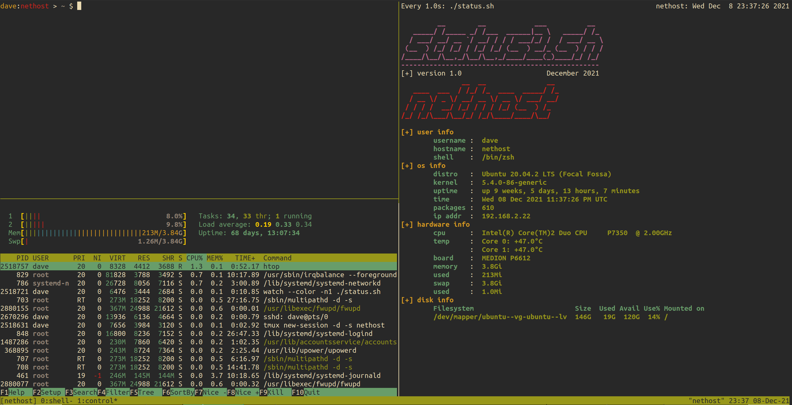

# status2

This is the "prettyfied" version of a small status Script I wrote a while ago and use pretty much 
on every networked Device I own.

It just displays various things of the Machine it's executed on, like Ram & Disk usage, Temperatures etc.

Since I basically only run Linux in my main LAN, there is little need for any other Operating Systems or fancy stuff.
If you want to use this, you'll very likely have to make adjustments depending on the machine, 
like the number of Cores, mounted Drives, whether you can get Temperatures etc.

Fixing the messy printing Code is left as an excercise for the reader :)

**Usage**

For simple usage, just download the file to where you want it, then

* `chmod +x status2.sh`
* `./status2.sh`

However, a _much_ nicer way of using this, is to have this part of a tmux setup.

The way I use this is like this (see screenshot below for end result):

* Have this file `status2.sh` on every networked Machine that I use with tmux.
  
* Start a tmux session on the remote Machine that sets up Windows and Panes the way I like it.
  
* Have one Window `control` and split this with `htop` and this script.

* Execute this script with `watch --color -n1 './status2.sh'` to get a continuous refresh. 
  
* Now I just `ssh user@server -t tmux attach` from my local machine to attach to the remote machine.

**Bugs**

* This obviously requires tweaks from Machine to Machine as there is no "intelligence" baked in
  to keep the Code small and compact.

* Usually when I put this on a new Machine, I adjust the Number of Cores and Drives and maybe add an ASCII header if I feel like it.

* As I said, the printing Code is kind of ugly and shellcheck doesn't like it at all, but at this point I don't care to fix it
  since I don't really plan to extend this further.

